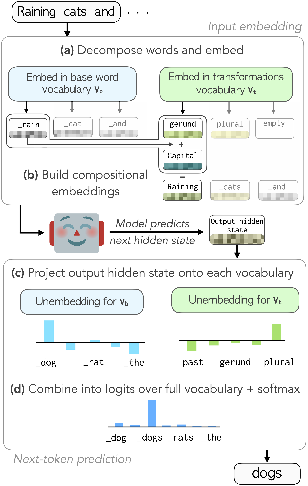

# Vocab Diet: Reshaping the Vocabulary of LLMs via Vector Arithmetic

**Yuval Reif, Guy Kaplan, and Roy Schwartz**

The Hebrew University of Jerusalem · Findings of ACL 2026

[**Paper (arXiv)**](https://arxiv.org/abs/2510.17001) · [**Project website**](https://vocabdiet.github.io/) · [ACL Anthology](https://aclanthology.org/2026.findings-acl.1618/)

Vocab Diet makes room for more words by sharing representations across word forms. Instead of storing separate vectors for *walk*, *walked*, and *walking*, we compose them from a base word and reusable transformation vectors—for example, **walked = walk + past tense**. The same idea applies to both input embeddings and output predictions, including words absent from the original vocabulary.

The paper demonstrates:

- **Compact pretrained vocabularies:** up to **10% fewer vocabulary entries** across five languages, with minimal impact on downstream performance. Adaptation trains transformation vectors and LoRA adapters while keeping the original backbone weights frozen.
- **Compositional pretraining:** roughly **42% fewer vocabulary entries** in English and Spanish. English achieves comparable language-modeling loss; Spanish has higher loss but more efficient tokenization.
- **Better multilingual coverage:** reallocating **10,000 freed English token slots** to Arabic, Russian, German, and Spanish improves average bytes per token by **9.3%**, without increasing vocabulary size.

<p align="center">
  <a href="https://vocabdiet.github.io/">
    
  </a>
</p>

*Compositional vocabulary: build input representations from base words and transformations, then combine their output scores to predict surface forms.*

See the [project website](https://vocabdiet.github.io/) for the research overview, figures, and results, and the [paper](https://arxiv.org/abs/2510.17001) for the full method and experiments.

This repository contains the adaptation, Patchscopes probes, pretraining, and vocabulary reallocation code.

## Installation

Use Python 3.12 for the tested local environment. From the repository root:

```bash
uv sync --locked --all-extras --python 3.12
source .venv/bin/activate
```

You can also use `python -m venv .venv` and `pip install -e '.[posthoc,pretraining,analysis,dev]'`. Install the PyTorch wheel appropriate for your CUDA environment before installing this repository on a GPU machine. Training requires CUDA; the lightweight tests and analysis tools run on CPU.

English morphology uses spaCy, WordNet, and a system Enchant dictionary. Set up the language resources as described in [resources/README.md](resources/README.md). Obtain any model access required by the model owner through your own Hugging Face account. Credentials belong in your environment or Hugging Face login, never in source files.

## Choose a workflow

| Task | Guide | Entry points |
| --- | --- | --- |
| Adapt a pretrained model with compositional embeddings and unembeddings | [Post-hoc adaptation](posthoc/README.md) | `python -m posthoc.adapt`, `python -m posthoc.adapt_multilingual` |
| Probe whether composed representations resolve to the intended word | [Patchscopes](posthoc/README.md) | `python -m posthoc.patchscopes`, `python -m posthoc.patchscopes_multilingual` |
| Train matched baseline and compositional models from scratch | [Pretraining](pretraining/README.md) | Tokenizer, preprocessing, and training scripts in `pretraining/` |
| Measure freed-slot reallocation and aggregate experiment results | [Analysis](analysis/README.md) | Analysis modules in `analysis/` |

Run commands from the repository root unless a workflow guide explicitly changes directory. All generated data, caches, checkpoints, and run outputs are excluded from version control.

## Method and reproduction

See the [method guide](docs/method.md) for the adaptation and pretraining formulations, and the [reproduction guide](docs/reproduction.md) for experimental settings, required artifacts, and reproduction status. The workflow guides above provide commands and resource setup.

## Validation

```bash
python -m pytest -q
ruff check .
```

The tests run without downloading model weights. Full training and evaluation require datasets, morphology resources, model access, and suitable GPUs.

## Citation

```bibtex
@inproceedings{reif-etal-2026-vocab,
  title = {Vocab Diet: Reshaping the Vocabulary of {LLM}s via Vector Arithmetic},
  author = {Reif, Yuval and Kaplan, Guy and Schwartz, Roy},
  booktitle = {Findings of the Association for Computational Linguistics: ACL 2026},
  year = {2026},
  pages = {32334--32352},
  doi = {10.18653/v1/2026.findings-acl.1618},
  url = {https://aclanthology.org/2026.findings-acl.1618/}
}
```

Our code is released under the [Apache License 2.0](LICENSE). Retained upstream components and their licenses are described in [THIRD_PARTY_NOTICES.md](THIRD_PARTY_NOTICES.md). Downloaded datasets and models retain their own licenses.
